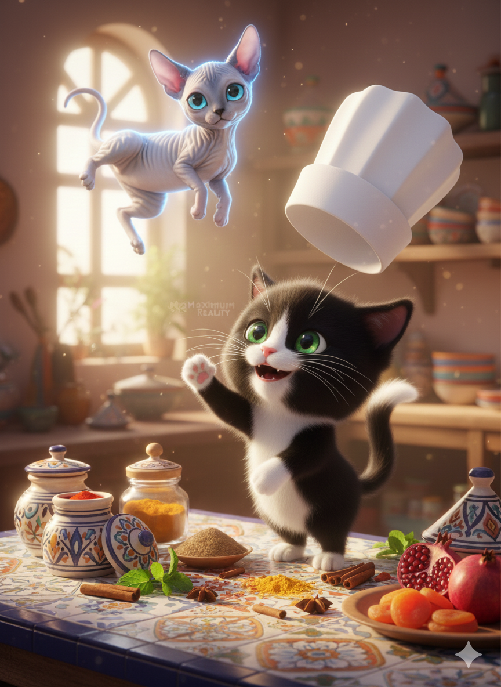
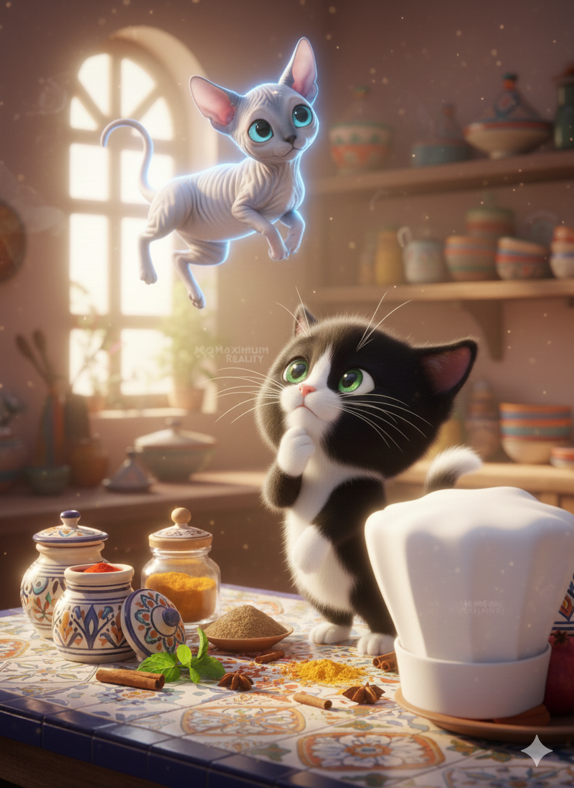
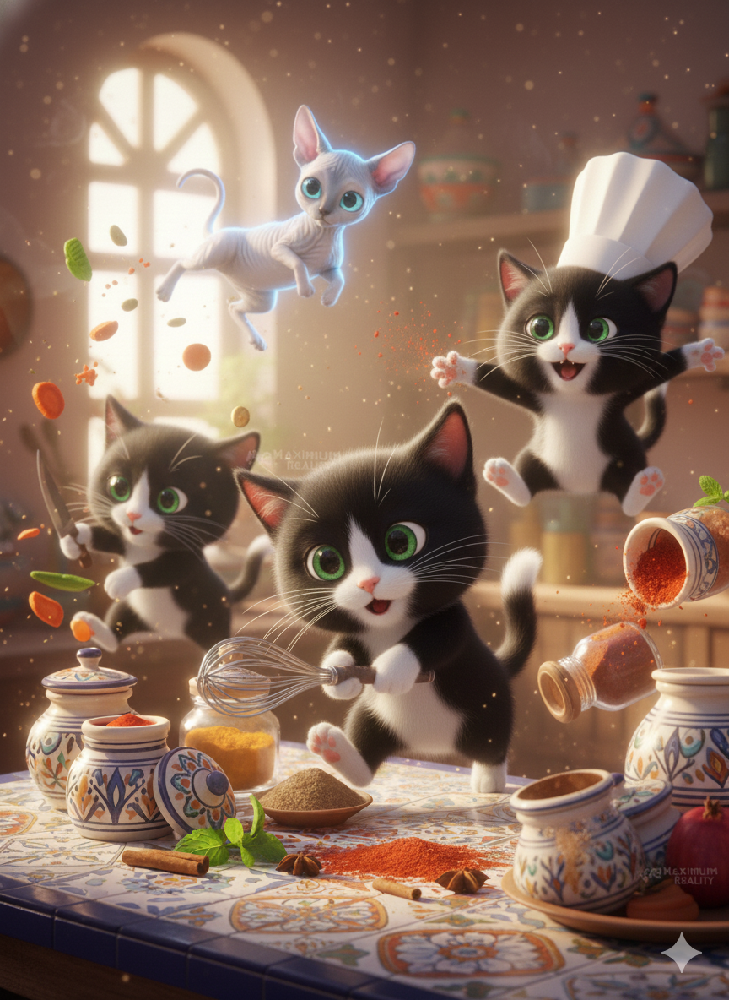
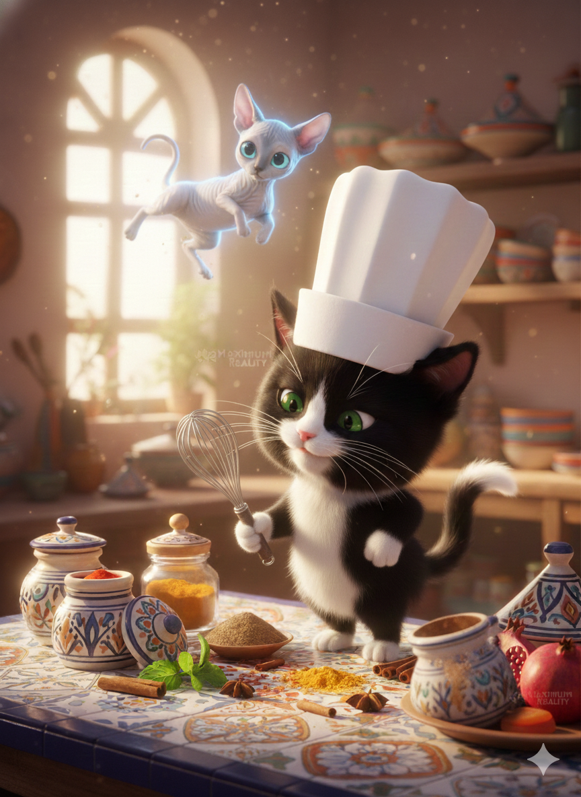
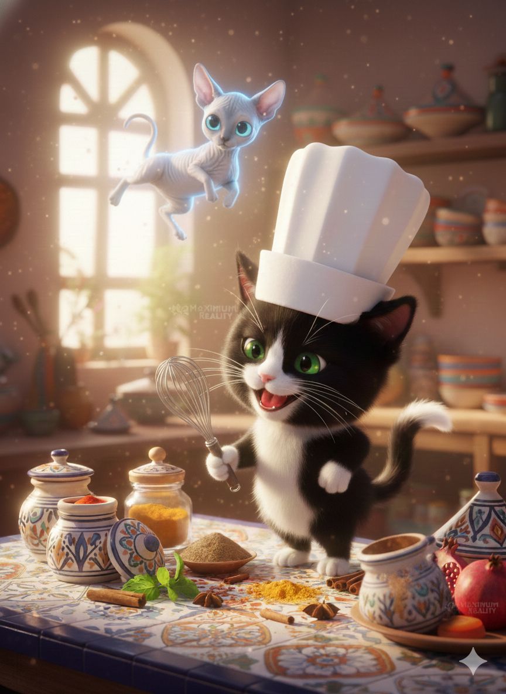

# 🐈‍⬛ Mochkil Builds Something

*Page 1*  
Mochkil woke up in his cozy Moroccan kitchen.  
He stretched, twitched his tail, and looked around at all the spices and ingredients scattered on the counter.  
*Image:* 

---

*Page 2*  
“I need a new idea!” he declared, flipping his tall chef hat.  
He glanced at Azul, floating lazily above the counter, who simply blinked and stared.  
*Image:* 

---

*Page 3*  
Mochkil thought hard.  
“I know! A game! And every recipe I make from now on will have Moroccan flair!”  
Azul twirled gently in the air, as if approving the plan.  
*Image:* 

---

*Page 4*  
He ran around the kitchen, whisking, chopping, and sprinkling spices with glee.  
Cumin, cinnamon, a pinch of magic — Mochkil worked as fast as his paws could move.  
*Image:* 

---

*Page 5*  
Finally, he paused, surveying his work.  
“Perfect,” he said, his whisk raised like a flag.  
Azul floated down to inspect.  
“CEO energy,” Mochkil whispered proudly.  
*Image:* 

---

*Page 6*  
And so, Mochkil’s first big idea was born:  
A game, recipes with Moroccan flair, and a little bit of chaos — just the way he liked it.  
*Image:* 
