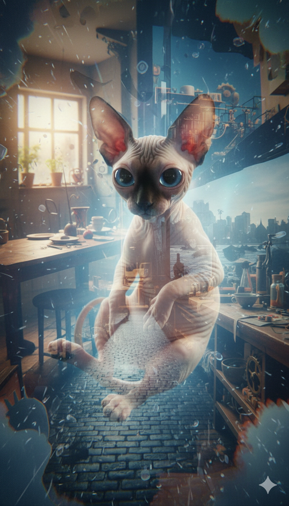
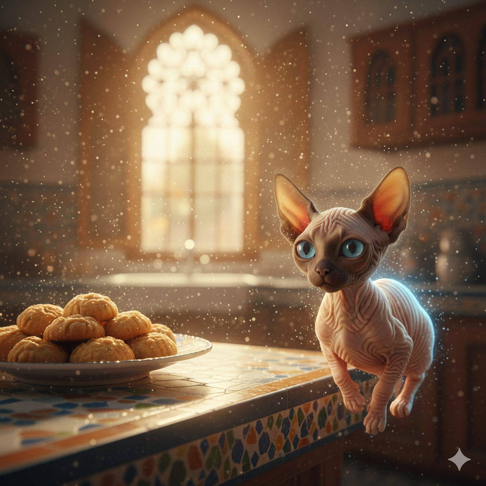
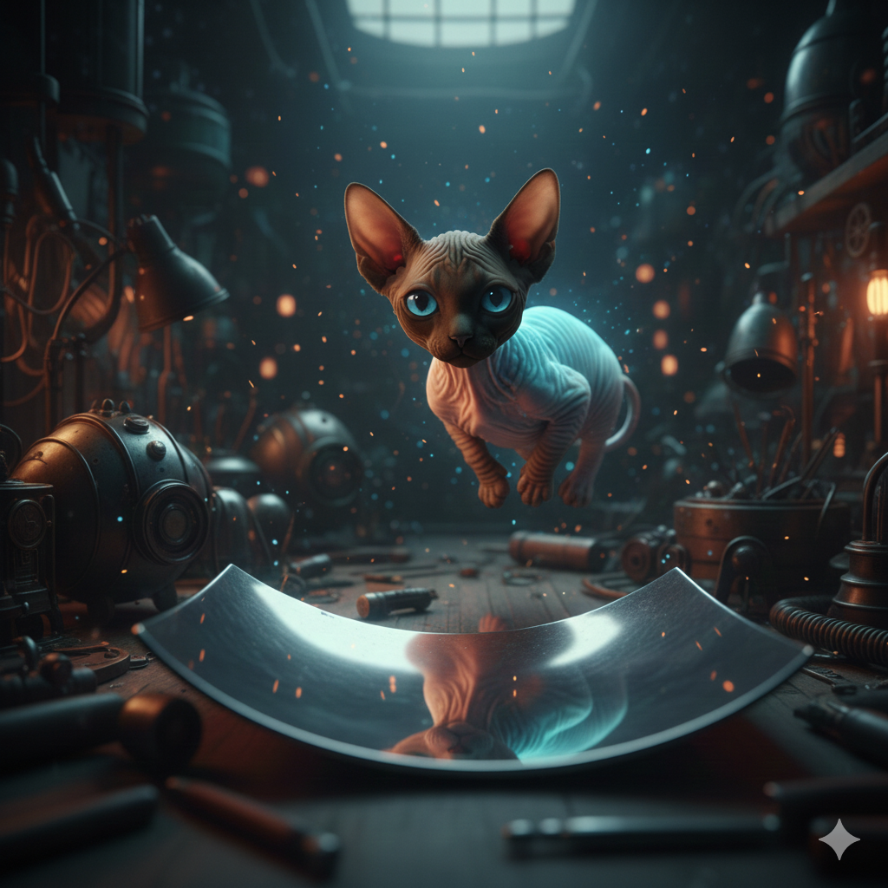
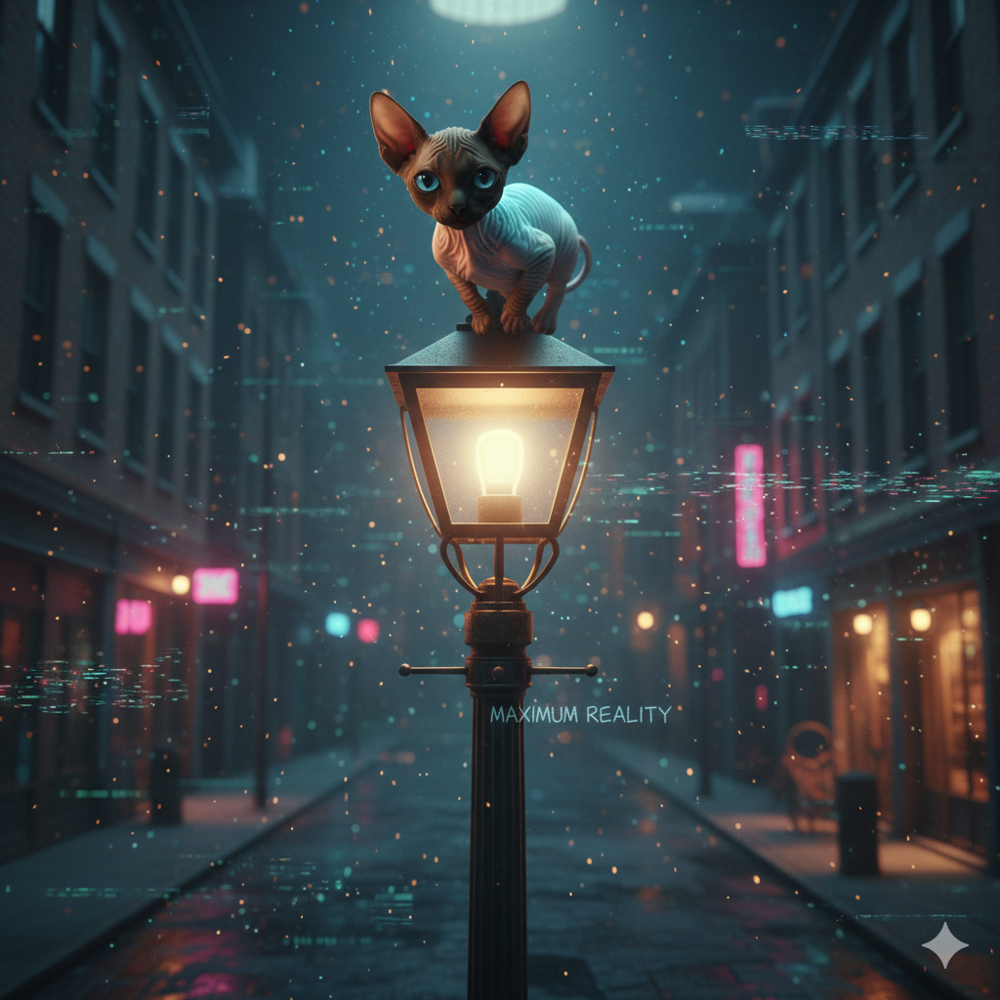
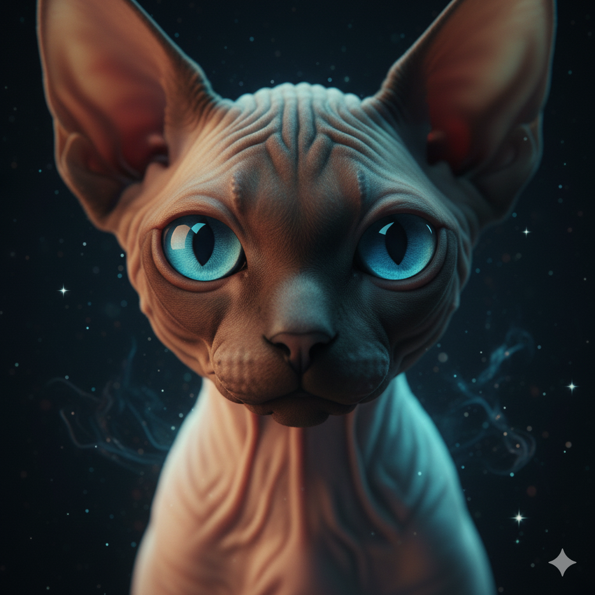
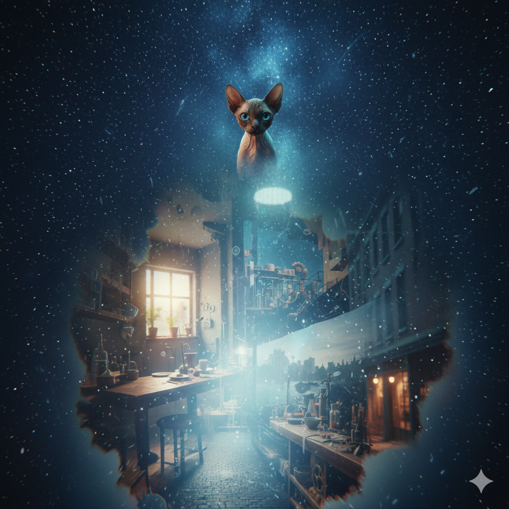

# 🐱✨ Azul Watches the World

**Series:** Azul  
**Universe:** Maximum Reality

---

## Scene 1 — Hero Image

Azul floats.

Not falling.  
Not flying.  
Just… *there*.

He is a hairless sphynx cat with soft peach-toned skin, oversized blue eyes, and a quiet glow that doesn’t seem to come from any single place. Light bends gently around him, as if the world has agreed to be polite.

Below him:  
A kitchen.  
A street.  
A room full of ideas that haven’t happened yet.

Azul blinks.

---

## Scene 2 — Somewhere Between

Azul drifts between multiple overlapping realities — a kitchen, a workshop, and a quiet street — all softly blurred and layered like reflections in glass. Bioluminescent light, holographic overlays, cinematic macro lighting, soft glow, surreal yet peaceful mood. Whimsical but grounded, high detail.

---

## Scene 3 — Kitchen Observation

A quiet Moroccan kitchen with sunlight through a window. A plate of date cookies cools on a counter.  
Two shapes move too fast to track properly:
- One small and clever  
- One large and annoyed  

There is chaos.  
There is sugar in the air.  
There will be consequences.

Azul tilts his head.  
He does not intervene.

---

## Scene 4 — Workshop Reflection

A cluttered creative workshop filled with tools, wires, and half-built inventions.  
Azul drifts past a reflective metal surface, his face faintly visible in the reflection.  
Soft sparks. Shallow depth of field. Moody lighting. Bioluminescent sci-fi fantasy aesthetic.

---

## Scene 5 — Streetlight / Reality Glitch

A nighttime street scene with a flickering streetlight.  
Azul sits impossibly balanced on top, glowing softly.  
Subtle digital glitches in the environment. Neon accents.  
The words “Maximum Reality” faintly scratched into the metal pole.  
Cinematic cyber-mystical tone.

---

## Scene 6 — Looking at the Viewer

Extreme close-up of Azul’s face, oversized blue eyes looking directly at the viewer.  
Soft bioluminescent glow. Calm, knowing expression. Dark background with faint stars.  
Intimate, reflective, emotionally warm. Ultra-detailed, cinematic lighting.

---

## Scene 7 — Drifting Away / Ending

Azul floats upward into a vast, star-filled space.  
Below, tiny hints of kitchens, streets, and rooms fade into abstraction.  
Peaceful, contemplative ending shot. Bioluminescent sci-fi fantasy style, soft gradients, cinematic framing.

Below him, stories continue:  
- Things are built  
- Cookies are stolen  
- Chaos behaves exactly as expected  

Azul drifts on.  
The world turns.  
Reality holds.  

*Azul will be seen again.*
