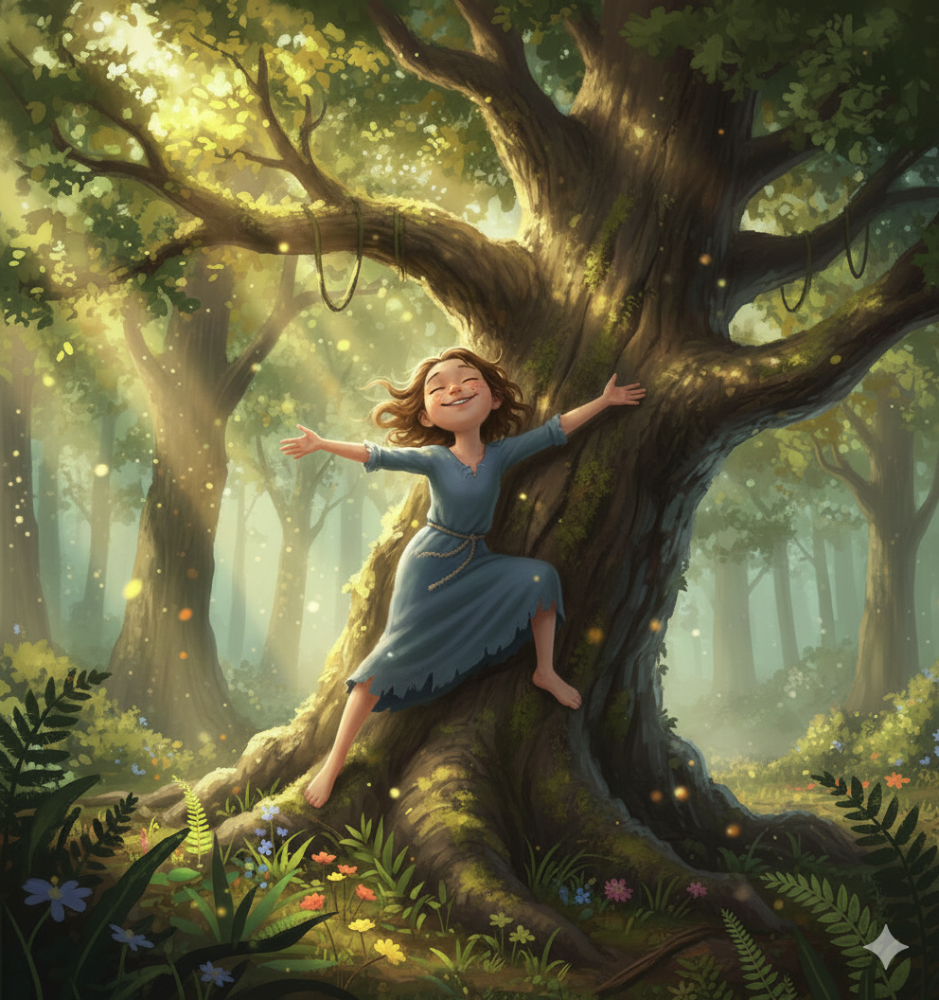
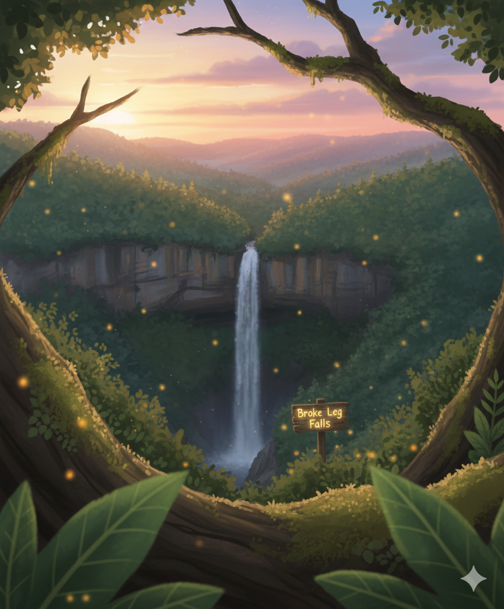
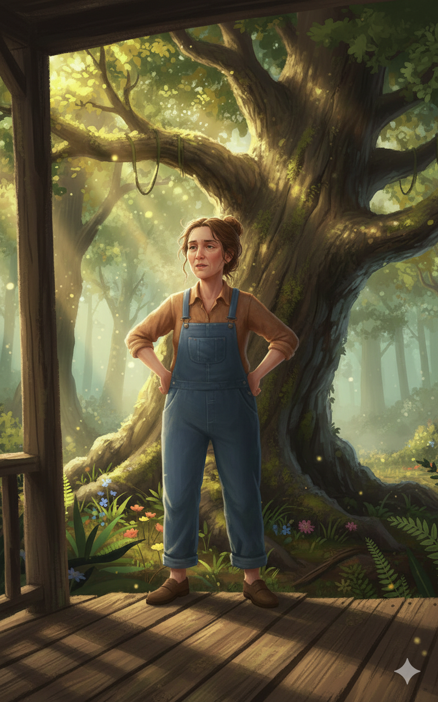
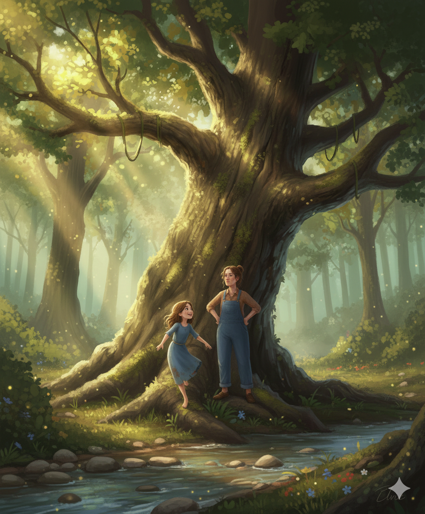

---
---
title: "Elvie & Eliza Jane: Tree-Top Adventures"
---
---

# 🌲 Elvie & Eliza Jane: Tree-Top Adventures

**Series:** Elvie & Eliza Jane  
**Setting:** Twin Branch, Kentucky, Appalachian Mountains

---

## Scene 1 — Backyard Mischief

Elvie, a sharp-eyed 10-year-old with freckles and tangled brown hair, crouches at the edge of the creek behind their cabin. She eyes the towering old oak tree that’s been calling her name all morning.

Eliza Jane, her mother and no-nonsense Appalachian matriarch who commands her porch like a lookout post, stands with her hands on her hips, surveying the yard. She speaks sparingly, each word sharp and timed perfectly:  

> “Elvie. That tree ain’t your friend. Get down.”

Elvie smirks and hops onto the first low branch, climbing like she’s done it a hundred times before.  

---

## Scene 2 — Tree-Top View

High up, Elvie perches on a sturdy limb, swaying gently in the breeze. She gasps at the view:  

> “I can see all the way to Broke Leg Falls from here!”

The Appalachian ridges stretch in golden greens, the creek sparkles below, and the smell of pine drifts through the air.

Eliza Jane calls up, voice clipped and commanding, with just enough humor to make it sting:  

> “Elvie. You’re not impressing the tree. Come down.”

Elvie laughs:  

> “I’m fine, Mama! I can see everything!”  

Eliza Jane shakes her head and mutters:  

> “Fine, see all you want. Just don’t make me have to rescue you.”

---

## Scene 3 — Hillbilly Wisdom

Eliza Jane leans against the porch railing, eyes on the girl, dry as ever:  

> “One of these days you’re gonna test gravity’s patience.”  

Elvie dangles a foot over the branch:  

> “Mama, sometimes you gotta get a little higher to see the bigger picture.”  

Eliza Jane smirks just slightly:  

> “Picture or no picture, dirt don’t care. Get down before it introduces itself.”

---

## Scene 4 — Safe Landing

After a few more minutes, Elvie carefully climbs down. Her shoes crunch against fallen leaves. Eliza Jane steps closer, voice brisk:  

> “See? Still in one piece. My nerves? Not so much.”  

Elvie grins, brushing her hands on her pants:  

> “Worth it. Ain’t nothin’ like Twin Branch from up there.”  

Eliza Jane mutters dryly:  

> “Next time, I’m bringin’ a ladder.”

They share a small laugh, then head toward the creek for the next adventure — the woods are full of mysteries, and the Appalachian sun sets slowly behind the ridges.  

---
