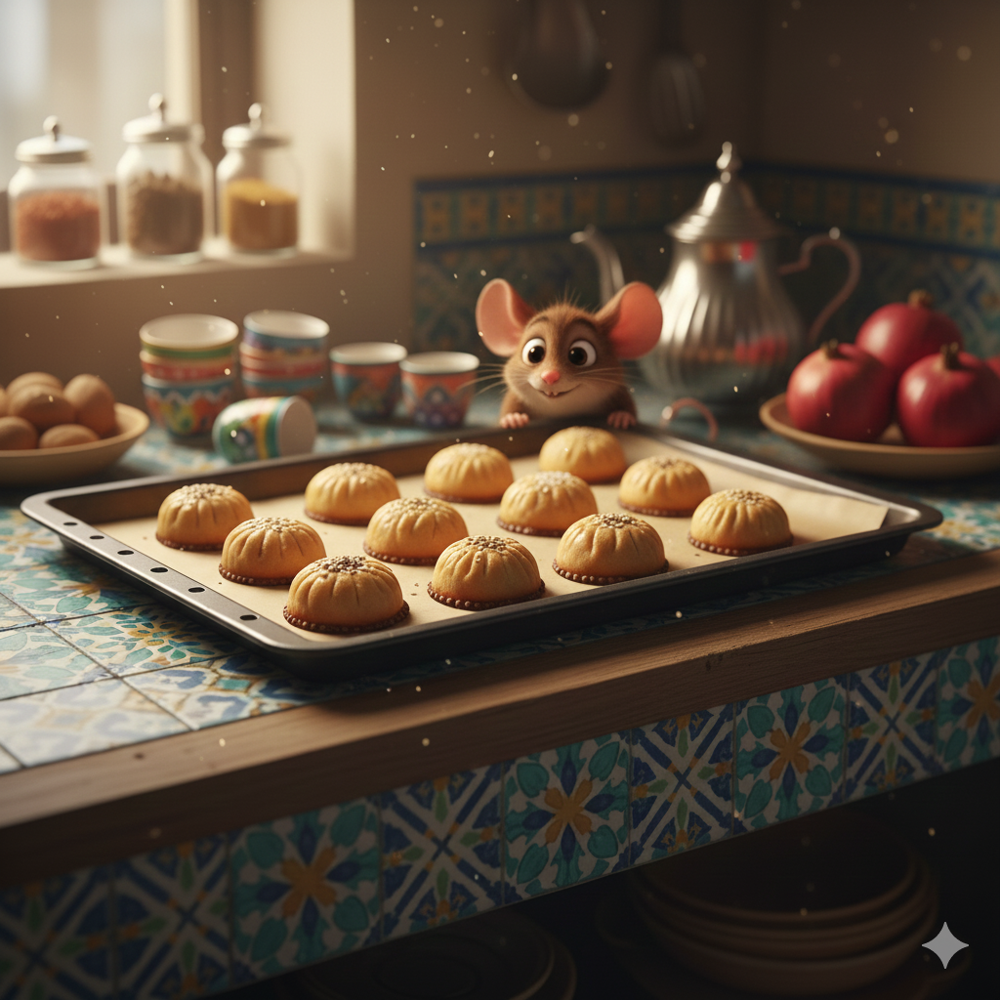
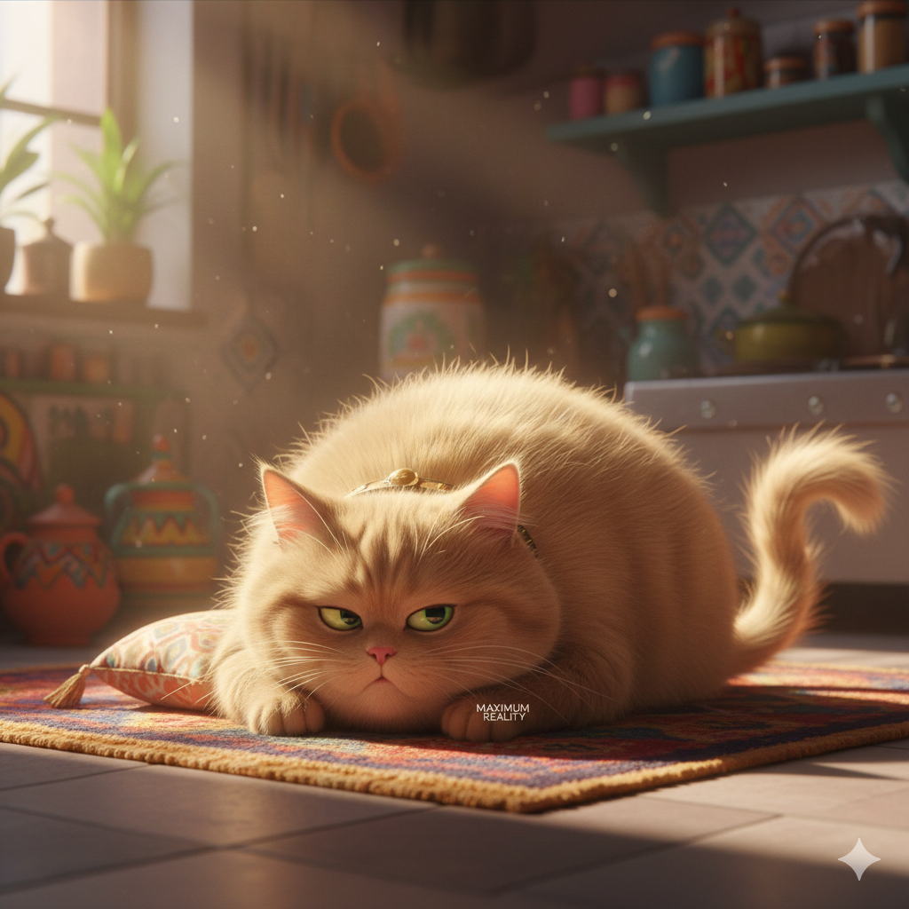
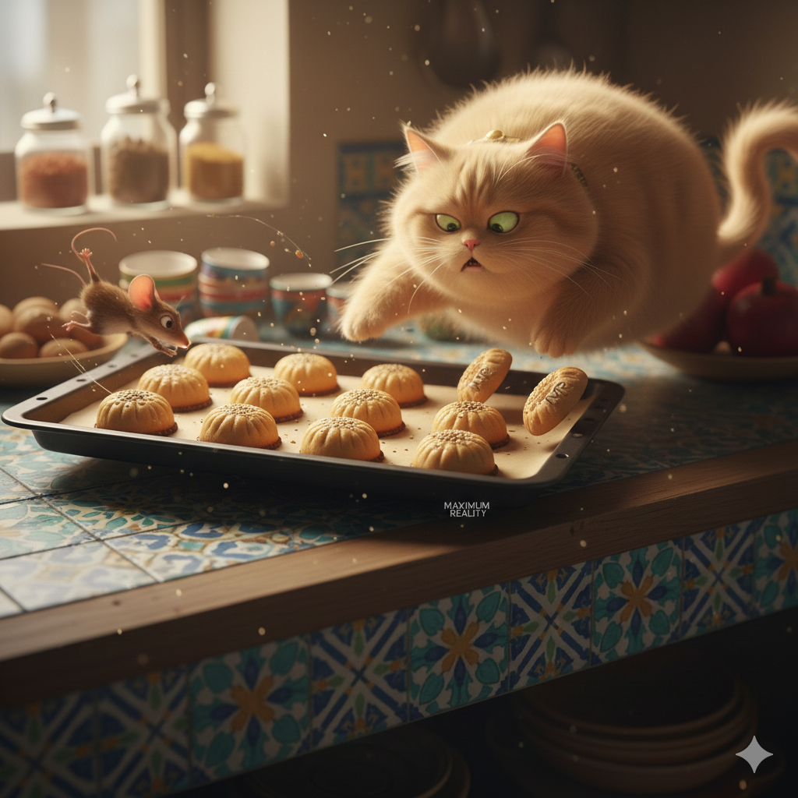
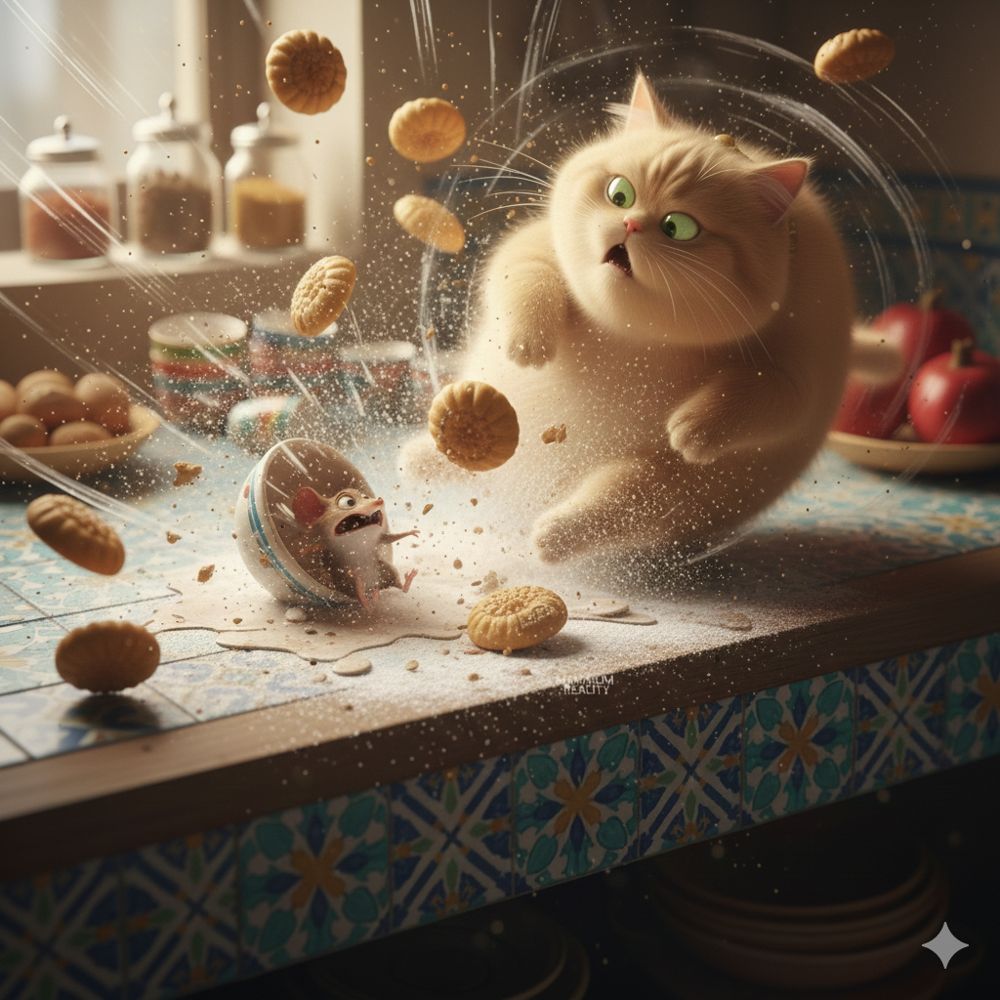
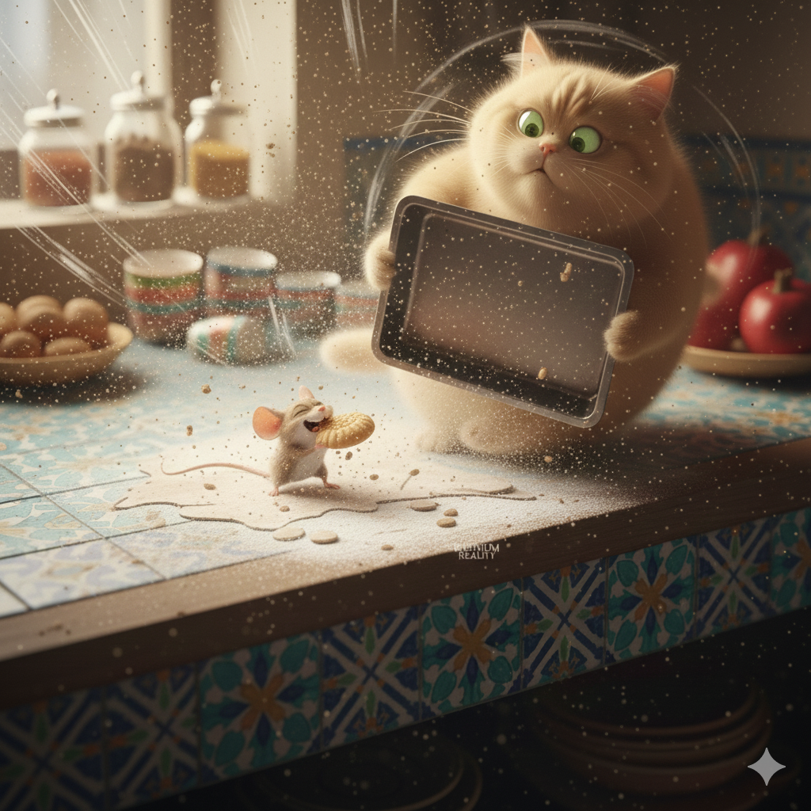
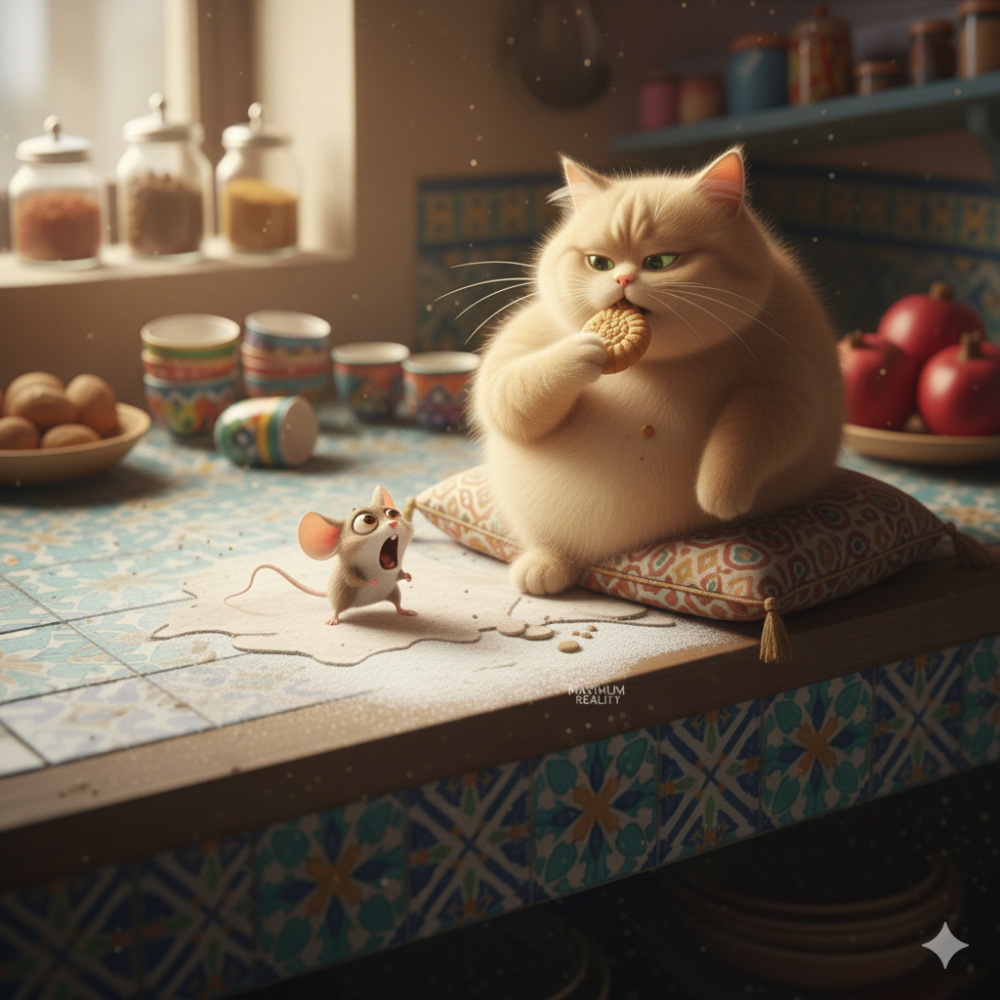
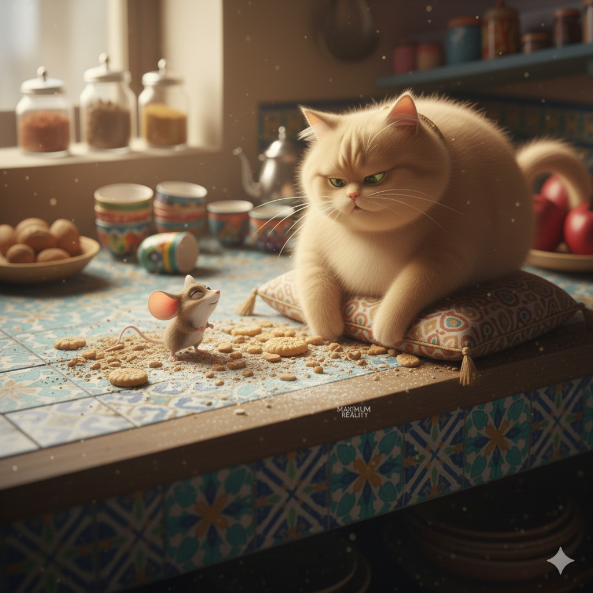

*Page 2*  
From behind the teapot, two shiny eyes appeared.  
Mishmish the mouse licked his lips.  
“Shwiya…” he whispered. *(Just a little…)*

---

*Page 3*  
Across the room, Bziz the cat slept in a loaf.  
One green eye opened.  
“Safi.” *(Enough.)*

---

*Page 4*  
Mishmish leapt.  
Bziz leapt.  
The cookie tray tipped.

“Yallah!” *(Let’s go!)*

---

*Page 5*  
Cookies flew.  
Mishmish skidded.  
Bziz slipped on powdered sugar and spun like a top.

“Hshouma!” *(Shame!)*

---

*Page 6*  
Everything stopped.  
Silence.

Mishmish held one cookie.  
Bziz held… the empty tray.

---

*Page 7*  
Mishmish took a bite.

“Bnin,” he said. *(Delicious.)*

---

*Page 8*  
Bziz sighed, flopped over, and stole the last cookie instead.  
Mishmish blinked.

“La!” *(No!)*

---

*Page 9*  
They sat together on the floor, crumbs everywhere.  
Sometimes, chaos tastes sweet.

